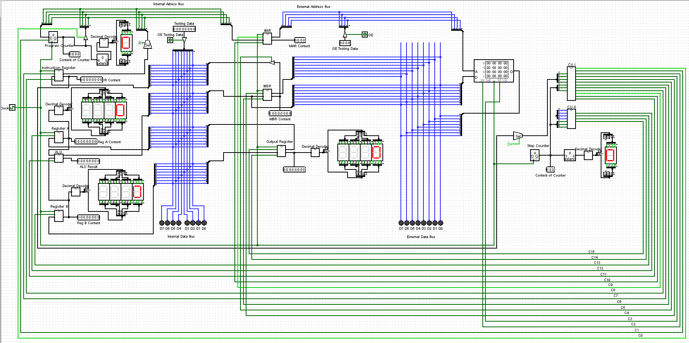
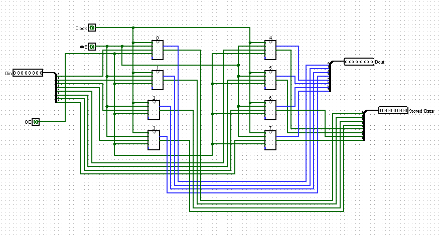

# 8-Bit CPU in Logisim

A custom-designed 8-bit CPU built entirely in Logisim Evolution.

This project was created by designing individual hardware components from scratch and combining them into a fully functional processor architecture.

---

## Features

- 8-bit CPU architecture
- Modular circuit design
- Custom ALU implementation
- Registers and memory management
- Control Unit (CU)
- Memory Address Register (MAR)
- Decimal Decoder
- Instruction fetch-decode-execute cycle
- RAM communication

---

## Components

### Memory Cell
Basic storage unit used for memory operations.

### Register
Stores temporary 8-bit data during execution.

### MAR (Memory Address Register)
Holds memory addresses for read/write operations.

### ALU (Arithmetic Logic Unit)
Performs arithmetic and logical operations.

### Decimal Decoder
Decodes instructions and generates signals.

### Control Unit (CU)
Controls instruction execution and manages data flow between components.

### CPU
Final integrated processor containing all modules.

---

## CPU Architecture

### CPU

### Register


---

## Instruction Cycle

1. Fetch instruction from memory
2. Decode instruction
3. Execute operation
4. Store result

---

## Technologies Used

- Logisim

---

## Project Structure

```txt
/MemoryCell
/Register
/MAR
/ALU
/DecimalDecoder
/ControlUnit
/CPU
/images
```

---

## Example Instruction Set

| Opcode | Instruction | Description |
|--------|-------------|-------------|
| 0001 | ADD | Addition |
| 0010 | SUB | Subtraction |
| 0011 | LOAD | Load data from memory |
| 0100 | STORE | Store data into memory |

---

## Goals of the Project

- Understanding computer architecture
- Learning digital logic design
- Simulating low-level CPU operations
- Building a processor from basic components
